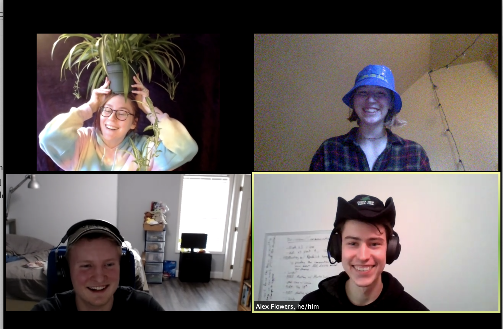

```{r global, include=FALSE}
# load data in 'global' chunk so it can be shared by all users of the dashboard
library(tidyverse)
library(here)
library(flexdashboard)
library(plotly)
library(extrafont)
library(knitr)

```


```{r}
oleks_data <- read.csv(here("oleks_data.csv"))
load(here("salary.Rdata"))

salary_potential <- salary_potential %>%
  mutate(diff_salary = mid_career_pay - early_career_pay)
oleks_data <- oleks_data %>%
  mutate(diff_salary = mid_career_pay - early_career_pay)

oleks_data <- oleks_data %>%
  mutate(CONTROL_2 = case_when(
    CONTROL == 2 ~ "Private",
    CONTROL == 1 ~ "Public"
  ))
```


Graph 
==================================================================


Input {.sidebar}
--------------------------------------------------------


```{r}
# This app works by gluing inputs together to get the right varible names


checkboxGroupInput("checkGroup", label = h4("Type of College"), 
    choices = list("Public" = "Public", "Private" = "Private"),
    selected = c("Public","Private"))
                                
radioButtons("radio", label = h4("Variable color represents"),
    choices = list("Salary Growth" = 15, "Percentage STEM majors" = 8, "Percentage who feel like they are making the world better" = 7), 
    selected = 15)
                


                                
```

Column{}
------------------------------------------------------

###

```{r fig.height= 6 }
  
# data_reactive <- reactive({
#   oleks_data %>%
#     filter(CONTROL_2 == input$checkGroup)
#   
#   
# })

library(GGally)
# Plot


oleks_data_reactive <- reactive({
  oleks_data %>%
 filter(CONTROL_2 == input$checkGroup) %>%
   rename("Early Career Salary" = "early_career_pay",
         "Mid Career Salary" = "mid_career_pay" ) %>%
  filter(CCBASIC_words == "Baccalaureate Colleges: Arts & Sciences Focus" |
           CCBASIC_words == "Baccalaureate Colleges: Diverse Fields" |
           #CCBASIC_words == "Baccalaureate/Associate's Colleges: Mixed Baccalaureate/Associate's" |
           CCBASIC_words == "Doctoral Universities: Very High Research Activity" |
           CCBASIC_words == "Doctoral Universities: High Research Activity"
           )
})

observe(print(oleks_data_reactive))

which_column_reactive <- reactive({
  as.numeric(input$radio)
})

legend_reactive <- reactive({
  if(input$radio == 15){paste("Salary Growth")}
  else if(input$radio == 8){paste("Percentage Stem Majors")}
  else(paste("Percentage Who Feel \n Like They Are Making \n The World Better")) 
})


output$plot<- renderPlotly({
 plot = ggparcoord(oleks_data_reactive(),
          mapping = aes(text = after_stat(oleks_data_reactive()$name)) , 
    columns = c(5,6),
    scale = "globalminmax",
    groupColumn = as.numeric(input$radio),
    alphaLines = 0.7
    ) +
  scale_color_viridis_c() +
  theme_minimal() +
  labs(y = "Dollars",
       x = "",
       color = legend_reactive(),
       title = "The Rich Get Richer") +
  theme(plot.title = element_text(hjust = 0.5, size = 20, family="Palatino"), 
        axis.title.y = element_text(family="Palatino", size = 16, face = "bold"), 
        legend.title = element_text(family="Palatino", face = "bold", size = 13), 
        axis.text.x = element_text(family="Palatino", face = "bold", size = 14)) 
 ggplotly(plot) %>%
  layout(xaxis = list(autorange = TRUE),
         yaxis = list(autorange = TRUE))
}) 
 
plotlyOutput("plot") 


# renderPrint(class(as.numeric(input$radio)))
```


Info 
=========================================================

Row{height = 600}
------------------------------------------------

### 


```{r}


```


Row{}
-----------------------------------------------

### 
Data From Tuition Tracker and College ScoreCard

Created By: Isabelle, Olek, Alex, and Lauren for the Reed Stats Club Data Viz Competition


Data was wrangled to include only the following Carnegie Classifications: Baccalaureate Colleges: Arts & Sciences Focus/Diverse Fields & Doctoral Universities: High Research Activity/Very High Research Activity  


